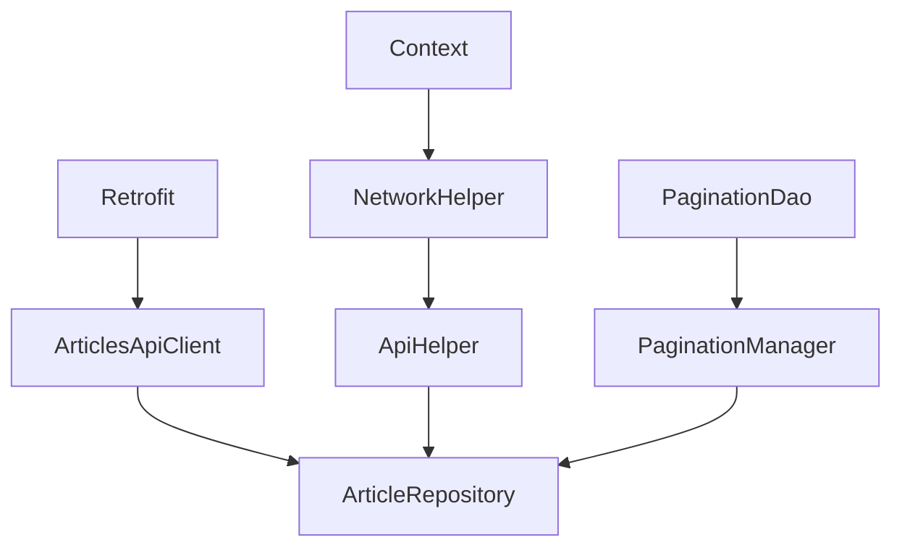

The Space Flight News app uses **Dagger Hilt** for dependency injection, a compile-time DI framework that generates code to wire dependencies automatically.

## Why Dependency Injection?

Dependency Injection provides several benefits:

<CardGroup cols={2}>
  <Card title="Testability" icon="flask">
    Easy to swap real implementations with mocks for testing
  </Card>
  <Card title="Decoupling" icon="link-slash">
    Classes don't create their dependencies, making them more flexible
  </Card>
  <Card title="Reusability" icon="recycle">
    Dependencies can be shared across multiple classes
  </Card>
  <Card title="Maintainability" icon="screwdriver-wrench">
    Changing implementations doesn't require modifying dependent classes
  </Card>
</CardGroup>

## Hilt Setup

### Application Class

The app is annotated with `@HiltAndroidApp` to enable dependency injection:

```kotlin com/bsvillarraga/spaceflightnews/MyApp.kt
package com.bsvillarraga.spaceflightnews

import android.app.Application
import dagger.hilt.android.HiltAndroidApp

@HiltAndroidApp
class MyApp: Application()
```

<Note>
This annotation triggers Hilt's code generation and initializes the dependency graph when the app starts.
</Note>

### Modules

Hilt uses modules to define how to provide dependencies. The app has two main modules:

1. **NetworkModule** - Provides network-related dependencies
2. **RoomModule** - Provides database-related dependencies

## NetworkModule

This module provides all network and repository dependencies:

```kotlin com/bsvillarraga/spaceflightnews/di/NetworkModule.kt
@Module
@InstallIn(SingletonComponent::class)
object NetworkModule {
    @Singleton
    @Provides
    fun provideRetrofit(): Retrofit {
        val client = OkHttpClient.Builder()
            .addInterceptor { chain ->
                val original = chain.request()
                val originalUrl = original.url()

                val newUrl = originalUrl.newBuilder()
                    .addQueryParameter("format", "json")
                    .build()

                val newRequest = original.newBuilder()
                    .url(newUrl)
                    .build()

                chain.proceed(newRequest)
            }
            .build()

        return Retrofit.Builder()
            .baseUrl("https://api.spaceflightnewsapi.net/")
            .client(client)
            .addConverterFactory(GsonConverterFactory.create())
            .build()
    }

    @Provides
    @Singleton
    fun provideNetworkHelper(@ApplicationContext context: Context): NetworkHelper {
        return NetworkHelper(context)
    }

    @Provides
    @Singleton
    fun provideApiHelper(networkHelper: NetworkHelper): ApiHelper {
        return ApiHelper(networkHelper)
    }

    @Provides
    @Singleton
    fun providePaginationManager(paginationDao: PaginationDao): PaginationManager {
        return PaginationManager(paginationDao)
    }

    @Singleton
    @Provides
    fun provideArticlesApiClient(retrofit: Retrofit): ArticlesApiClient =
        retrofit.create(ArticlesApiClient::class.java)

    @Provides
    @Singleton
    fun provideArticleRepository(
        api: ArticlesApiClient,
        apiHelper: ApiHelper,
        paginationManager: PaginationManager
    ): ArticleRepository =
        ArticleRepositoryImpl(api, apiHelper, paginationManager)
}
```

### Key Annotations

<AccordionGroup>
  <Accordion title="@Module">
    Marks a class as a Hilt module. Modules tell Hilt how to provide instances of certain types.
  </Accordion>
  
  <Accordion title="@InstallIn(SingletonComponent::class)">
    Specifies which Hilt component this module should be installed in. `SingletonComponent` means these dependencies live as long as the application.
    
    Other options include:
    - `ActivityComponent` - Scoped to an Activity's lifecycle
    - `FragmentComponent` - Scoped to a Fragment's lifecycle
    - `ViewModelComponent` - Scoped to a ViewModel's lifecycle
  </Accordion>
  
  <Accordion title="@Provides">
    Marks a function that provides a dependency. The return type tells Hilt what this function provides.
  </Accordion>
  
  <Accordion title="@Singleton">
    Ensures only one instance of this dependency exists throughout the app's lifetime.
  </Accordion>
  
  <Accordion title="@ApplicationContext">
    Qualifier annotation that tells Hilt to inject the Application context, not an Activity context.
  </Accordion>
</AccordionGroup>

### Dependency Chain in NetworkModule

Notice how dependencies reference each other:



<Note>
Hilt automatically resolves the dependency graph. When you request `ArticleRepository`, Hilt knows it needs `ArticlesApiClient`, `ApiHelper`, and `PaginationManager`, and provides them automatically.
</Note>

### Retrofit Configuration

The Retrofit provider includes a custom interceptor:

```kotlin com/bsvillarraga/spaceflightnews/di/NetworkModule.kt:33-48
val client = OkHttpClient.Builder()
    .addInterceptor { chain ->
        val original = chain.request()
        val originalUrl = original.url()

        val newUrl = originalUrl.newBuilder()
            .addQueryParameter("format", "json")
            .build()

        val newRequest = original.newBuilder()
            .url(newUrl)
            .build()

        chain.proceed(newRequest)
    }
    .build()
```

<Warning>
This interceptor adds `?format=json` to every API request automatically. This is preferable to adding it manually to each endpoint.
</Warning>

### Repository Binding

The repository provider binds the interface to its implementation:

```kotlin com/bsvillarraga/spaceflightnews/di/NetworkModule.kt:84-91
@Provides
@Singleton
fun provideArticleRepository(
    api: ArticlesApiClient,
    apiHelper: ApiHelper,
    paginationManager: PaginationManager
): ArticleRepository =
    ArticleRepositoryImpl(api, apiHelper, paginationManager)
```

<Note>
The return type is `ArticleRepository` (interface), but the implementation is `ArticleRepositoryImpl`. This allows the domain and presentation layers to depend on the interface only.
</Note>

## RoomModule

This module provides database dependencies:

```kotlin com/bsvillarraga/spaceflightnews/di/RoomModule.kt
@Module
@InstallIn(SingletonComponent::class)
object RoomModule {
    private const val SPACE_FLIGHT_NEW = "space_flight_news_database"

    @Singleton
    @Provides
    fun provideAppDatabase(@ApplicationContext context: Context) =
        Room.databaseBuilder(context, SpaceFlightNewsDb::class.java, SPACE_FLIGHT_NEW).build()

    @Singleton
    @Provides
    fun providePaginationDao(db: SpaceFlightNewsDb) = db.paginationDao()
}
```

<AccordionGroup>
  <Accordion title="Database Dependency">
    Hilt provides the Room database instance as a singleton, ensuring only one database connection exists.
    
    ```kotlin
    @Singleton
    @Provides
    fun provideAppDatabase(@ApplicationContext context: Context) =
        Room.databaseBuilder(context, SpaceFlightNewsDb::class.java, SPACE_FLIGHT_NEW).build()
    ```
  </Accordion>
  
  <Accordion title="DAO Dependency">
    The DAO provider depends on the database. Hilt automatically provides the database instance.
    
    ```kotlin
    @Singleton
    @Provides
    fun providePaginationDao(db: SpaceFlightNewsDb) = db.paginationDao()
    ```
  </Accordion>
</AccordionGroup>

## Constructor Injection

Classes that Hilt can create automatically use `@Inject` on their constructor:

### Repository Implementation

```kotlin com/bsvillarraga/spaceflightnews/data/repository/ArticleRepositoryImpl.kt:29-33
class ArticleRepositoryImpl @Inject constructor(
    private val api: ArticlesApiClient,
    private val apiHelper: ApiHelper,
    private val paginationManager: PaginationManager
) : ArticleRepository {
```

<Note>
The `@Inject` annotation tells Hilt this class can be constructed by providing these three dependencies. No need for a `@Provides` function in a module.
</Note>

### Use Cases

```kotlin com/bsvillarraga/spaceflightnews/domain/usecase/GetArticlesUseCase.kt:15-17
class GetArticlesUseCase @Inject constructor(
    private val repository: ArticleRepository
) {
```

Use cases are also injected via constructor, receiving the `ArticleRepository` interface.

### ViewModels

ViewModels use a special annotation:

```kotlin com/bsvillarraga/spaceflightnews/presentation/ui/articles/viewmodel/ArticlesViewModel.kt:20-24
@HiltViewModel
class ArticlesViewModel @Inject constructor(
    private val articleUseCase: GetArticlesUseCase
) : ViewModel() {
```

<Warning>
ViewModels require `@HiltViewModel` annotation instead of just `@Inject`. This integrates with Android's ViewModel lifecycle.
</Warning>

## Injection Points

### Fragments

Fragments use `@AndroidEntryPoint` to enable field injection:

```kotlin com/bsvillarraga/spaceflightnews/presentation/ui/articles/ArticlesFragment.kt:41-49
@AndroidEntryPoint
class ArticlesFragment : Fragment(), MenuProvider {
    private lateinit var binding: FragmentArticlesBinding
    private lateinit var adapter: ArticleAdapter

    private var searchView: SearchView? = null
    private var searchMenuItem: MenuItem? = null

    private val viewModel: ArticlesViewModel by viewModels()
```

<Note>
The `by viewModels()` delegate automatically obtains the ViewModel from Hilt with all its dependencies injected.
</Note>

### Activities

Activities also use `@AndroidEntryPoint`:

```kotlin
@AndroidEntryPoint
class MainActivity : AppCompatActivity() {
    // Hilt can inject dependencies here
}
```

## Dependency Graph Visualization

Here's how the complete dependency graph flows:

```
Application (@HiltAndroidApp)
    │
    ├─> NetworkModule (@InstallIn(SingletonComponent))
    │   ├─> Retrofit (@Singleton)
    │   ├─> NetworkHelper (@Singleton)
    │   ├─> ApiHelper (@Singleton)
    │   ├─> PaginationManager (@Singleton)
    │   ├─> ArticlesApiClient (@Singleton)
    │   └─> ArticleRepository (@Singleton)
    │       └─> ArticleRepositoryImpl (@Inject)
    │
    ├─> RoomModule (@InstallIn(SingletonComponent))
    │   ├─> SpaceFlightNewsDb (@Singleton)
    │   └─> PaginationDao (@Singleton)
    │
    ├─> Use Cases (@Inject)
    │   └─> GetArticlesUseCase
    │
    ├─> ViewModels (@HiltViewModel)
    │   └─> ArticlesViewModel
    │
    └─> UI Components (@AndroidEntryPoint)
        └─> ArticlesFragment
```

## Benefits in Practice

<AccordionGroup>
  <Accordion title="No Manual Wiring">
    Without DI, you'd need code like:
    ```kotlin
    // DON'T DO THIS - No DI
    val retrofit = Retrofit.Builder()...
    val api = retrofit.create(ArticlesApiClient::class.java)
    val networkHelper = NetworkHelper(context)
    val apiHelper = ApiHelper(networkHelper)
    val paginationDao = database.paginationDao()
    val paginationManager = PaginationManager(paginationDao)
    val repository = ArticleRepositoryImpl(api, apiHelper, paginationManager)
    val useCase = GetArticlesUseCase(repository)
    val viewModel = ArticlesViewModel(useCase)
    ```
    
    With Hilt, it's just:
    ```kotlin
    // DO THIS - With Hilt
    private val viewModel: ArticlesViewModel by viewModels()
    ```
  </Accordion>
  
  <Accordion title="Easy Testing">
    In tests, you can provide mock implementations:
    
    ```kotlin
    @TestInstallIn(
        components = [SingletonComponent::class],
        replaces = [NetworkModule::class]
    )
    @Module
    object TestNetworkModule {
        @Provides
        @Singleton
        fun provideArticleRepository(): ArticleRepository {
            return FakeArticleRepository() // Mock implementation
        }
    }
    ```
  </Accordion>
  
  <Accordion title="Lifecycle Management">
    Hilt automatically handles lifecycle:
    - Singletons live for the entire app
    - Activity-scoped dependencies die with the Activity
    - ViewModel-scoped dependencies survive configuration changes
  </Accordion>
  
  <Accordion title="Compile-Time Safety">
    Hilt generates code at compile time. If dependencies are missing or circular, you get a compile error, not a runtime crash.
  </Accordion>
</AccordionGroup>

## Common Patterns

### Singleton Dependencies

Use `@Singleton` for dependencies that should be shared:

```kotlin
@Provides
@Singleton
fun provideRetrofit(): Retrofit { /* ... */ }
```

<Card icon="check" title="Good for Singletons">
- Network clients (Retrofit, OkHttpClient)
- Database instances (Room)
- Repositories
- SharedPreferences
- Analytics/Logging services
</Card>

### Unscoped Dependencies

Omit `@Singleton` for dependencies that should be created fresh:

```kotlin
@Provides
fun provideMapper(): DataMapper {
    return DataMapper()
}
```

<Card icon="xmark" title="Don't Use Singletons For">
- Stateful objects that shouldn't be shared
- Objects with short lifecycles
- Test doubles in unit tests
</Card>

### Interface Binding

Always return interfaces when possible:

```kotlin
@Provides
@Singleton
fun provideArticleRepository(
    // ... dependencies
): ArticleRepository =  // Return interface type
    ArticleRepositoryImpl(...)  // Actual implementation
```

<Note>
This allows you to swap implementations without changing dependent classes.
</Note>

## Debugging Tips

<Steps>
  <Step title="Check Module Installation">
    Ensure modules are installed in the correct component with `@InstallIn`
  </Step>
  
  <Step title="Verify @Inject Annotations">
    Constructor injection requires `@Inject` on the constructor
  </Step>
  
  <Step title="Check Return Types">
    `@Provides` functions should return the type you want to inject (usually interfaces)
  </Step>
  
  <Step title="Look for Circular Dependencies">
    If A depends on B and B depends on A, Hilt can't create either
  </Step>
  
  <Step title="Rebuild the Project">
    Hilt generates code at compile time - clean and rebuild if things seem broken
  </Step>
</Steps>

## Related Resources

<CardGroup cols={2}>
  <Card title="Architecture Overview" icon="sitemap" href="/architecture/overview">
    See how DI fits into the overall architecture
  </Card>
  <Card title="Clean Architecture" icon="layer-group" href="/architecture/clean-architecture">
    Understand the layers that DI connects
  </Card>
</CardGroup>