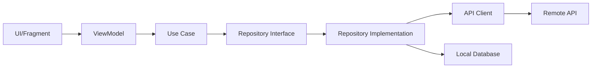

The Space Flight News Android app follows Clean Architecture principles combined with MVVM (Model-View-ViewModel) pattern to create a scalable, maintainable, and testable codebase.

## Architecture Principles

The app is structured around three core architectural principles:

1. **Separation of Concerns**: Each layer has a distinct responsibility
2. **Dependency Inversion**: Dependencies point inward toward the domain layer
3. **Testability**: Business logic is independent of Android framework

## Layer Structure

The application is organized into three main layers:

<CardGroup cols={3}>
  <Card title="Presentation" icon="mobile" color="#ea5a0c">
    UI components, ViewModels, and user interaction logic
  </Card>
  <Card title="Domain" icon="brain" color="#0285c7">
    Business logic, use cases, and domain models
  </Card>
  <Card title="Data" icon="database" color="#16a34a">
    Data sources, repositories, and API clients
  </Card>
</CardGroup>

## Package Structure

The codebase is organized into the following packages:

```
com.bsvillarraga.spaceflightnews/
├── core/                    # Shared utilities and common classes
│   ├── common/             # Resource wrapper, base classes
│   ├── extensions/         # Kotlin extension functions
│   └── network/            # Network helpers
├── data/                    # Data layer
│   ├── local/              # Room database, DAOs, entities
│   ├── model/              # DTOs (Data Transfer Objects)
│   ├── remote/             # API clients, API helpers
│   ├── repository/         # Repository implementations
│   └── utils/              # Data layer utilities
├── di/                      # Dependency injection modules
│   ├── NetworkModule.kt    # Network dependencies
│   └── RoomModule.kt       # Database dependencies
├── domain/                  # Domain layer
│   ├── model/              # Domain models
│   ├── repository/         # Repository interfaces
│   └── usecase/            # Use cases (business logic)
└── presentation/            # Presentation layer
    ├── permission/         # Permission handling
    └── ui/                 # Fragments, ViewModels, adapters
```

## Data Flow

The typical data flow through the architecture follows this pattern:



<Steps>
  <Step title="User Interaction">
    User interacts with the UI (Fragment/Activity)
  </Step>
  <Step title="ViewModel Processing">
    ViewModel receives the event and calls the appropriate Use Case
  </Step>
  <Step title="Business Logic">
    Use Case executes business logic and calls the Repository
  </Step>
  <Step title="Data Retrieval">
    Repository fetches data from remote API or local database
  </Step>
  <Step title="Data Transformation">
    Data is transformed from DTOs to Domain models
  </Step>
  <Step title="UI Update">
    ViewModel updates LiveData/StateFlow, triggering UI updates
  </Step>
</Steps>

## Core Components

### Resource Wrapper

The app uses a sealed class to represent operation states:

```kotlin com/bsvillarraga/spaceflightnews/core/common/Resource.kt
sealed class Resource<out T> {
    data class Success<out T>(val data: T?) : Resource<T>()
    data class Error<out T>(val code: String?, val msg: String, val error: Throwable? = null) : Resource<T>()
    data class Loading<out T>(val data: T? = null) : Resource<T>()
}
```

<Note>
The `Resource` class provides a type-safe way to handle loading, success, and error states throughout the application.
</Note>

### Dependency Injection

The app uses **Dagger Hilt** for dependency injection, configured at the application level:

```kotlin com/bsvillarraga/spaceflightnews/MyApp.kt:4-7
@HiltAndroidApp
class MyApp: Application()
```

## Key Features

<AccordionGroup>
  <Accordion title="Clean Architecture">
    - Clear separation between layers
    - Business logic independent of frameworks
    - Easy to test and maintain
  </Accordion>
  
  <Accordion title="Reactive Programming">
    - Kotlin Coroutines for asynchronous operations
    - LiveData and StateFlow for reactive UI updates
    - Flow-based search with debouncing
  </Accordion>
  
  <Accordion title="Dependency Injection">
    - Dagger Hilt for compile-time dependency injection
    - Singleton components for shared resources
    - Constructor injection for testability
  </Accordion>
  
  <Accordion title="Type Safety">
    - Kotlin's type system for compile-time safety
    - Domain models separate from DTOs
    - Sealed classes for state management
  </Accordion>
</AccordionGroup>

## Next Steps

<CardGroup cols={2}>
  <Card title="Clean Architecture" icon="layer-group" href="/architecture/clean-architecture">
    Deep dive into the three-layer architecture
  </Card>
  <Card title="Dependency Injection" icon="plug" href="/architecture/dependency-injection">
    Learn how Dagger Hilt is configured
  </Card>
</CardGroup>