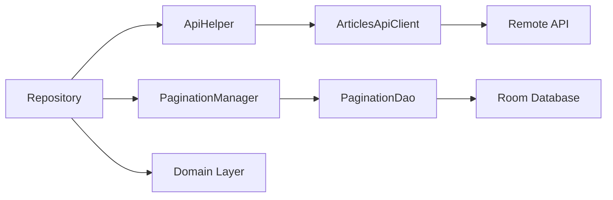

The data layer is responsible for managing all data sources in the Space Flight News app, including remote API calls and local database storage. It implements the repository pattern to provide a clean abstraction for data access.

## Architecture Overview

The data layer consists of three main components:

1. **Remote Data Sources**: API clients using Retrofit
2. **Local Data Sources**: Room database for caching and pagination
3. **Repositories**: Implementations that coordinate between remote and local sources

<CardGroup cols={3}>
  <Card title="API Clients" icon="cloud">
    Retrofit interfaces for network calls
  </Card>
  <Card title="Local Database" icon="database">
    Room database for offline support
  </Card>
  <Card title="Repositories" icon="folder-tree">
    Data coordination and mapping
  </Card>
</CardGroup>

## Remote Data Sources

API clients are defined as Retrofit interfaces that describe the endpoints and HTTP methods.

### ArticlesApiClient

The main API client for fetching space flight news articles:

```kotlin data/remote/articles/ArticlesApiClient.kt
interface ArticlesApiClient {
    @GET("v4/articles")
    suspend fun getArticles(
        @Query("search") query: String? = null,
        @Query("offset") offset: Int? = null,
        @Query("limit") limit: Int? = 10,
        @Query("ordering") sort: Array<String>? = arrayOf("-published_at")
    ): Response<PaginationDto>

    @GET("v4/articles/{id}")
    suspend fun getArticleById(@Path("id") articleId: Long): Response<ArticleDto>
}
```

<Note>
  All API calls are suspend functions, making them compatible with Kotlin coroutines for asynchronous operations.
</Note>

### ApiHelper

The `ApiHelper` class provides safe API call execution with automatic error handling:

```kotlin data/remote/ApiHelper.kt
class ApiHelper @Inject constructor(
    private val networkHelper: NetworkHelper
) {
    suspend fun <T> safeApiCall(call: suspend () -> Response<T>): ApiResponse<T> {
        return try {
            if (networkHelper.isNetworkAvailable()) {
                val response = call.invoke()
                ApiResponse.create(response)
            } else {
                ApiErrorResponse("5", "Sin conexión a internet")
            }
        } catch (e: SocketTimeoutException) {
            ApiResponse.create(e)
        } catch (e: HttpException) {
            ApiResponse.create(e)
         catch (e: IOException) {
            ApiResponse.create(e)
        } catch (e: Exception) {
            ApiResponse.create(e)
        }
    }
}
```

<Tip>
  The `ApiHelper` checks for network availability before making requests and handles common exceptions like timeouts and HTTP errors.
</Tip>

## Data Transfer Objects (DTOs)

DTOs represent the API response structure and include mapping functions to domain models.

### ArticleDto

```kotlin data/model/ArticleDto.kt
data class ArticleDto(
    val id: Long,
    val title: String,
    val authors: List<AuthorDto>,
    val url: String,
    @SerializedName("image_url")
    val imageUrl: String,
    @SerializedName("news_site")
    val newsSite: String,
    val summary: String,
    @SerializedName("published_at")
    val publishedAt: String,
    @SerializedName("updated_at")
    val updatedAt: String,
    val featured: Boolean,
    val launches: List<LaunchDto>,
    val events: List<EventDto>,
) {
    fun toArticleDomain(): Article = Article(
        id = id,
        title = title,
        imageUrl = imageUrl,
        newsSite = newsSite,
        publishedAt = publishedAt
    )

    fun toArticleDetailDomain(): ArticleDetail = ArticleDetail(
        id = id,
        title = title,
        authors = authors.map { it.toDomain() },
        url = url,
        newsSite = newsSite,
        imageUrl = imageUrl,
        summary = summary,
        publishedAt = publishedAt,
        updatedAt = updatedAt
    )
}
```

<Info>
  DTOs include mapping functions (`toArticleDomain()`, `toArticleDetailDomain()`) to convert API responses into domain models, separating external data structures from internal business logic.
</Info>

## Local Data Sources

The app uses Room for local data persistence, primarily for pagination management.

### Database Configuration

```kotlin data/local/SpaceFlightNewsDb.kt
@Database(entities = [PaginationEntity::class], version = 1)
abstract class SpaceFlightNewsDb: RoomDatabase() {
    abstract fun paginationDao(): PaginationDao
}
```

### PaginationDao

```kotlin data/local/dao/PaginationDao.kt
@Dao
interface PaginationDao {
    @Insert(onConflict = OnConflictStrategy.REPLACE)
    suspend fun insertPagination(pagination: PaginationEntity)

    @Query("DELETE FROM pagination")
    suspend fun deletePagination()

    @Query("SELECT * FROM pagination")
    suspend fun getPagination(): PaginationEntity?
}
```

### PaginationManager

Manages pagination state across app sessions:

```kotlin data/utils/PaginationManager.kt
class PaginationManager @Inject constructor(private val paginationDao: PaginationDao) {
    suspend fun getCurrentOffset(): Int? {
        return paginationDao.getPagination()?.offset
    }

    suspend fun updatePagination(paginationDto: PaginationDto) {
        val offset = extractOffset(paginationDto.next)
        paginationDao.deletePagination()
        
        if (paginationDto.articles.isNotEmpty()) {
            paginationDao.insertPagination(
                PaginationEntity(
                    count = paginationDto.count,
                    offset = offset
                )
            )
        }
    }

    private fun extractOffset(url: String?): Int? {
        return url?.let { Uri.parse(it).getQueryParameter("offset")?.toIntOrNull() }
    }
}
```

## Repository Implementation

Repositories coordinate between remote and local data sources while mapping data to domain models.

### ArticleRepositoryImpl

```kotlin data/repository/ArticleRepositoryImpl.kt
class ArticleRepositoryImpl @Inject constructor(
    private val api: ArticlesApiClient,
    private val apiHelper: ApiHelper,
    private val paginationManager: PaginationManager
) : ArticleRepository {

    override suspend fun getArticles(
        query: String?
    ): Resource<List<Article>> {
        return withContext(Dispatchers.IO) {
            val response: ApiResponse<PaginationDto> =
                apiHelper.safeApiCall {
                    api.getArticles(query, paginationManager.getCurrentOffset())
                }

            when (response) {
                is ApiSuccessResponse -> {
                    val pagination = response.body
                    paginationManager.updatePagination(pagination)
                    Resource.Success(pagination.articles.map { it.toArticleDomain() })
                }
                is ApiErrorResponse -> Resource.Error(response.code, response.msg, response.error)
            }
        }
    }

    override suspend fun getArticleById(articleId: Long): Resource<ArticleDetail> {
        return withContext(Dispatchers.IO) {
            val response: ApiResponse<ArticleDto> =
                apiHelper.safeApiCall { api.getArticleById(articleId) }

            when (response) {
                is ApiSuccessResponse -> {
                    val article = response.body
                    Resource.Success(article.toArticleDetailDomain())
                }
                is ApiErrorResponse -> Resource.Error(response.code, response.msg, response.error)
            }
        }
    }
}
```

## Data Flow



## Key Features

<AccordionGroup>
  <Accordion title="Error Handling">
    The `ApiHelper` class provides centralized error handling for:
    - Network connectivity issues
    - HTTP errors and status codes
    - Timeouts and IO exceptions
    - Generic exception fallbacks
  </Accordion>

  <Accordion title="Pagination Management">
    The `PaginationManager` stores pagination state locally to:
    - Track the current offset for API requests
    - Enable seamless infinite scrolling
    - Persist pagination across app sessions
  </Accordion>

  <Accordion title="Data Mapping">
    DTOs include mapping functions that:
    - Convert API models to domain models
    - Keep external data structures separate from business logic
    - Support different levels of detail (Article vs ArticleDetail)
  </Accordion>

  <Accordion title="Dependency Injection">
    All components use constructor injection with Hilt:
    - `@Inject` annotations for automatic dependency provision
    - Configured in `NetworkModule` and `RoomModule`
    - Enables easy testing with mock implementations
  </Accordion>
</AccordionGroup>

## Related Components

<CardGroup cols={2}>
  <Card title="Domain Layer" icon="diagram-project" href="/components/domain-layer">
    Learn about domain models and use cases
  </Card>
  <Card title="Presentation Layer" icon="mobile" href="/components/presentation-layer">
    Explore ViewModels and UI components
  </Card>
</CardGroup>
