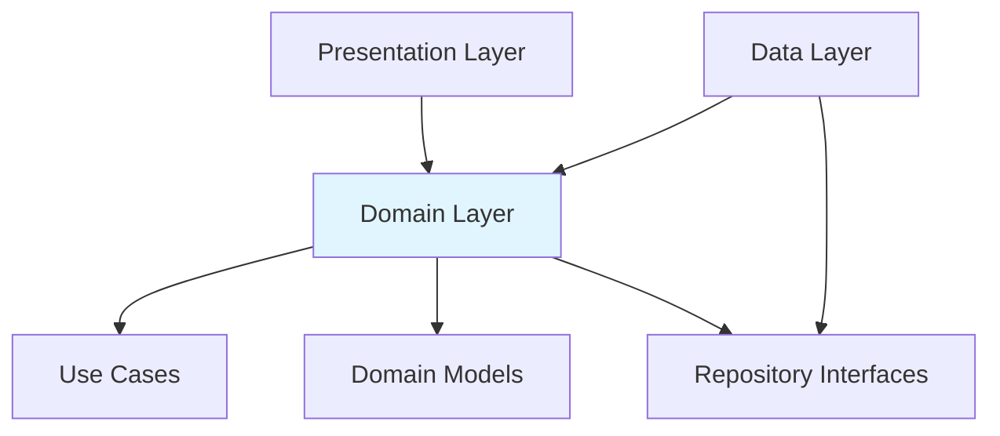

The domain layer is the core of the application architecture, containing business logic, use cases, and domain models. It's framework-independent and defines contracts that other layers must implement.

## Architecture Overview

The domain layer follows Clean Architecture principles with three main components:

<CardGroup cols={3}>
  <Card title="Domain Models" icon="box">
    Pure data classes representing business entities
  </Card>
  <Card title="Repository Interfaces" icon="handshake">
    Contracts defining data access operations
  </Card>
  <Card title="Use Cases" icon="gear">
    Business logic orchestration
  </Card>
</CardGroup>

## Domain Models

Domain models are pure Kotlin data classes that represent business entities without any framework dependencies.

### Article

Represents a simplified article for list views:

```kotlin domain/model/Article.kt
data class Article(
    val id: Long,
    val title: String,
    val imageUrl: String,
    val newsSite: String,
    val publishedAt: String
)
```

<Note>
  The `Article` model contains only essential fields needed for displaying article lists, optimizing performance and memory usage.
</Note>

### ArticleDetail

Represents a complete article with all details:

```kotlin domain/model/ArticleDetail.kt
data class ArticleDetail(
    val id: Long,
    val title: String,
    val authors: List<Author>,
    val url: String,
    val newsSite: String,
    val imageUrl: String,
    val summary: String,
    val publishedAt: String,
    val updatedAt: String
)
```

<Info>
  Having separate models for list and detail views follows the principle of data tailoring - each screen gets exactly the data it needs.
</Info>

### Resource

A sealed class that wraps data with loading and error states:

```kotlin core/common/Resource.kt
sealed class Resource<out T> {
    data class Success<out T>(val data: T?) : Resource<T>()
    data class Error<out T>(val code: String?, val msg: String, val error: Throwable? = null) : Resource<T>()
    data class Loading<out T>(val data: T? = null) : Resource<T>()
}
```

<Tip>
  The `Resource` class provides a type-safe way to represent asynchronous operations, making it easy for the UI to handle loading, success, and error states.
</Tip>

## Repository Interfaces

Repository interfaces define contracts for data access without specifying implementation details.

### ArticleRepository

```kotlin domain/repository/ArticleRepository.kt
interface ArticleRepository {
    suspend fun getArticles(
        query: String? = null
    ): Resource<List<Article>>

    suspend fun getArticleById(articleId: Long): Resource<ArticleDetail>
}
```

<AccordionGroup>
  <Accordion title="Why use interfaces?">
    Repository interfaces provide several benefits:
    - **Abstraction**: The domain layer doesn't need to know about implementation details
    - **Testability**: Easy to create mock implementations for unit tests
    - **Flexibility**: Can swap implementations without changing business logic
    - **Dependency Inversion**: High-level modules don't depend on low-level modules
  </Accordion>

  <Accordion title="Suspend functions">
    All repository methods are `suspend` functions, which means:
    - They can be called from coroutines
    - They're non-blocking and asynchronous
    - They integrate seamlessly with Kotlin's coroutine framework
    - They enable structured concurrency
  </Accordion>
</AccordionGroup>

## Use Cases

Use cases encapsulate specific business logic operations. Each use case has a single responsibility and coordinates between repositories and the presentation layer.

### GetArticlesUseCase

Retrieves a list of articles with optional search filtering:

```kotlin domain/usecase/GetArticlesUseCase.kt
class GetArticlesUseCase @Inject constructor(
    private val repository: ArticleRepository
) {
    suspend fun getArticles(query: String? = null): Resource<List<Article>> {
        return repository.getArticles(query)
    }
}
```

### GetArticleByIdUseCase

Retrieves detailed information for a specific article:

```kotlin domain/usecase/GetArticleByIdUseCase.kt
class GetArticleByIdUseCase @Inject constructor(
    private val repository: ArticleRepository
) {
    suspend fun getArticleById(articleId: Long): Resource<ArticleDetail> {
        return repository.getArticleById(articleId)
    }
}
```

<Note>
  While these use cases appear simple, they serve as a layer of indirection that can be extended with additional business logic, validation, or data transformation as the app grows.
</Note>

## Benefits of Use Cases

<CardGroup cols={2}>
  <Card title="Single Responsibility" icon="bullseye">
    Each use case has one clear purpose
  </Card>
  <Card title="Reusability" icon="recycle">
    Can be shared across multiple ViewModels
  </Card>
  <Card title="Testability" icon="flask">
    Easy to unit test in isolation
  </Card>
  <Card title="Business Logic Centralization" icon="building">
    All business rules in one place
  </Card>
</CardGroup>

## Dependency Flow

The domain layer is at the center of the architecture:



<Info>
  Notice that dependencies flow inward. The domain layer doesn't depend on the presentation or data layers, making it the most stable part of the architecture.
</Info>

## Clean Architecture Principles

The domain layer implements several Clean Architecture principles:

<AccordionGroup>
  <Accordion title="Independence of Frameworks">
    Domain models and use cases don't depend on Android SDK, Retrofit, Room, or any external frameworks. This makes them:
    - Easy to test without Android dependencies
    - Portable to other platforms
    - Free from framework version constraints
  </Accordion>

  <Accordion title="Testability">
    Pure business logic with no external dependencies:
    ```kotlin
    class GetArticlesUseCaseTest {
        @Test
        fun `getArticles returns success when repository succeeds`() = runTest {
            // Given
            val mockRepository = mockk<ArticleRepository>()
            coEvery { mockRepository.getArticles(null) } returns 
                Resource.Success(listOf(mockArticle))
            val useCase = GetArticlesUseCase(mockRepository)
            
            // When
            val result = useCase.getArticles()
            
            // Then
            assertTrue(result is Resource.Success)
        }
    }
    ```
  </Accordion>

  <Accordion title="Separation of Concerns">
    Clear boundaries between different types of logic:
    - **Models**: Data structure
    - **Repositories**: Data access contracts
    - **Use Cases**: Business operations
    
    Each component has a single, well-defined purpose.
  </Accordion>

  <Accordion title="Dependency Inversion">
    The data layer implements interfaces defined in the domain layer:
    ```kotlin
    // Domain layer defines the contract
    interface ArticleRepository { ... }
    
    // Data layer implements it
    class ArticleRepositoryImpl : ArticleRepository { ... }
    ```
    This means the domain layer controls the contract while remaining independent of implementation details.
  </Accordion>
</AccordionGroup>

## Communication Between Layers

Here's how the domain layer interacts with other layers:

<Steps>
  <Step title="Presentation calls Use Case">
    ViewModel invokes a use case method:
    ```kotlin
    val result = articleUseCase.getArticles(query)
    ```
  </Step>
  
  <Step title="Use Case calls Repository">
    Use case delegates to repository interface:
    ```kotlin
    return repository.getArticles(query)
    ```
  </Step>
  
  <Step title="Repository Implementation executes">
    The data layer's implementation performs the actual work:
    ```kotlin
    // In ArticleRepositoryImpl
    val response = apiHelper.safeApiCall { ... }
    ```
  </Step>
  
  <Step title="Domain Model returned">
    Data layer maps DTOs to domain models:
    ```kotlin
    Resource.Success(pagination.articles.map { it.toArticleDomain() })
    ```
  </Step>
</Steps>

## Best Practices

<CardGroup cols={2}>
  <Card title="Keep It Pure" icon="droplet">
    Domain models should be pure data classes without business logic methods
  </Card>
  <Card title="Single Purpose" icon="bullseye">
    Each use case should do one thing well
  </Card>
  <Card title="Framework Free" icon="ban">
    No Android or external framework dependencies
  </Card>
  <Card title="Immutable Models" icon="lock">
    Use `val` properties to ensure data immutability
  </Card>
</CardGroup>

## Related Components

<CardGroup cols={2}>
  <Card title="Data Layer" icon="database" href="/components/data-layer">
    Explore repository implementations
  </Card>
  <Card title="Presentation Layer" icon="mobile" href="/components/presentation-layer">
    See how ViewModels use use cases
  </Card>
</CardGroup>
