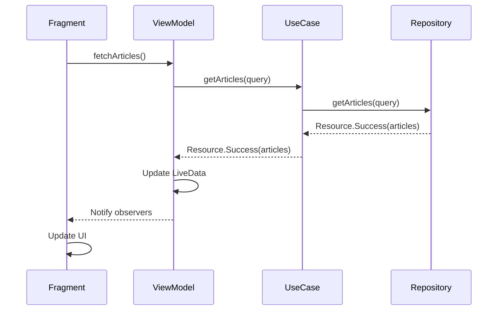

The presentation layer manages all user interface concerns, implementing the MVVM (Model-View-ViewModel) pattern to separate UI logic from business logic. It consists of ViewModels, Fragments, and RecyclerView adapters.

## Architecture Overview

<CardGroup cols={3}>
  <Card title="ViewModels" icon="brain">
    UI state management and business logic coordination
  </Card>
  <Card title="Fragments" icon="window">
    UI rendering and user interaction
  </Card>
  <Card title="Adapters" icon="list">
    RecyclerView data binding
  </Card>
</CardGroup>

## ViewModels

ViewModels manage UI state and coordinate with use cases. They survive configuration changes and expose data through LiveData or StateFlow.

### ArticlesViewModel

Manages the article list screen with search and pagination:

```kotlin presentation/ui/articles/viewmodel/ArticlesViewModel.kt
@HiltViewModel
class ArticlesViewModel @Inject constructor(
    private val articleUseCase: GetArticlesUseCase
) : ViewModel() {

    private val _articles = MutableLiveData<Resource<List<Article>>>(Resource.Loading())
    val articles: LiveData<Resource<List<Article>>> = _articles

    private val _searchQuery = MutableStateFlow("")
    private val _currentList = mutableListOf<Article>()

    init {
        observeSearchQuery()
    }

    private fun observeSearchQuery() {
        viewModelScope.launch {
            _searchQuery.debounce(300).distinctUntilChanged().collectLatest { query ->
                _currentList.clear()
                fetchArticles(query.ifEmpty { null }, reload = true)
            }
        }
    }

    fun fetchArticles(query: String? = null, reload: Boolean = false, loadMore: Boolean = false) {
        if (!reload && !loadMore && _currentList.isNotEmpty()) return

        if (reload) {
            _articles.value = Resource.Loading()
        }

        viewModelScope.launch {
            handleResult(articleUseCase.getArticles(query ?: onGetSearchQueryChanged()), loadMore)
        }
    }

    private fun handleResult(result: Resource<List<Article>>, loadMore: Boolean) {
        when (result) {
            is Resource.Success -> {
                if (!loadMore) {
                    _currentList.clear()
                }
                _currentList.addAll(result.data ?: listOf())
                _articles.value = Resource.Success(_currentList.toList())
            }
            is Resource.Error -> _articles.value = result
            is Resource.Loading -> _articles.value = Resource.Loading()
        }
    }

    fun onSearchQueryChanged(query: String) {
        _searchQuery.value = query
    }

    fun onGetSearchQueryChanged(): String {
        return _searchQuery.value
    }
}
```

<AccordionGroup>
  <Accordion title="Search Debouncing">
    The ViewModel uses Flow operators to optimize search:
    - `debounce(300)`: Waits 300ms after the user stops typing
    - `distinctUntilChanged()`: Only triggers when the query actually changes
    - `collectLatest`: Cancels previous searches if a new one starts
    
    This prevents excessive API calls while the user is typing.
  </Accordion>

  <Accordion title="Pagination Support">
    The `fetchArticles` method supports three modes:
    - **Initial load**: `reload = false, loadMore = false`
    - **Pull to refresh**: `reload = true`
    - **Load more**: `loadMore = true`
    
    The `_currentList` maintains the accumulated articles for infinite scrolling.
  </Accordion>

  <Accordion title="State Management">
    Uses both LiveData and StateFlow:
    - **LiveData** for UI state that Fragments observe
    - **StateFlow** for internal state like search query
    - Exposes immutable versions to prevent external modification
  </Accordion>
</AccordionGroup>

### ArticleDetailsViewModel

Manages the article detail screen:

```kotlin presentation/ui/articles/viewmodel/ArticleDetailsViewModel.kt
@HiltViewModel
class ArticleDetailsViewModel @Inject constructor(
    private val articleById: GetArticleByIdUseCase
) : ViewModel() {
    private var hasLoaded = false

    private val _article = MutableLiveData<Resource<ArticleDetail>>()
    val article: LiveData<Resource<ArticleDetail>> = _article

    fun fetchArticleById(id: Long, reload: Boolean = false) {
        if (hasLoaded && !reload) return
        _article.value = Resource.Loading()

        viewModelScope.launch {
            _article.value = articleById.getArticleById(id)
            hasLoaded = true
        }
    }
}
```

<Note>
  The `hasLoaded` flag prevents unnecessary re-fetching when the screen is revisited during the same session, improving performance and reducing API calls.
</Note>

## Fragments

Fragments render the UI and observe ViewModel state changes.

### ArticlesFragment

Displays a list of articles with search and infinite scrolling:

```kotlin presentation/ui/articles/ArticlesFragment.kt
@AndroidEntryPoint
class ArticlesFragment : Fragment(), MenuProvider {
    private lateinit var binding: FragmentArticlesBinding
    private lateinit var adapter: ArticleAdapter
    private val viewModel: ArticlesViewModel by viewModels()

    override fun onViewCreated(view: View, savedInstanceState: Bundle?) {
        super.onViewCreated(view, savedInstanceState)
        setupSearch()
        setupRecyclerView()
        fetchArticle()
        observeArticle()
    }

    private fun setupRecyclerView() {
        adapter = ArticleAdapter(
            onItemClicked = { article ->
                navigateArticlesToArticleDetail(article)
            }
        )

        binding.rcvArticles.init(this@ArticlesFragment.adapter, requireContext())
        binding.rcvArticles.onLoadMoreScrollListener {
            loadMoreArticle()
        }
    }

    private fun loadMoreArticle() {
        if (adapter.itemCount == 0) return
        adapter.setLoading(true)
        viewModel.fetchArticles(loadMore = true)
    }

    private fun observeArticle() {
        viewModel.articles.observe(viewLifecycleOwner) { resource ->
            handleResource(resource)
        }
    }

    private fun handleResource(resource: Resource<List<Article>>) {
        when (resource) {
            is Resource.Error -> showError()
            is Resource.Loading -> showLoading()
            is Resource.Success -> loadData(resource.data)
        }
    }

    private fun navigateArticlesToArticleDetail(article: Article) {
        findNavController().navigate(
            ArticlesFragmentDirections.actionArticlesFragmentToArticleDetailFragment(
                articleId = article.id,
                newsSite = article.newsSite
            )
        )
    }
}
```

<Tip>
  The Fragment uses View Binding for type-safe view access and ViewModel delegation with `by viewModels()` for automatic ViewModel creation and lifecycle management.
</Tip>

### Key Fragment Features

<CardGroup cols={2}>
  <Card title="Voice Search" icon="microphone">
    Integrates Android's speech recognition for hands-free search
  </Card>
  <Card title="Pull to Refresh" icon="arrows-rotate">
    Swipe gesture to reload the article list
  </Card>
  <Card title="Infinite Scroll" icon="down-long">
    Automatically loads more articles when reaching the bottom
  </Card>
  <Card title="State Views" icon="eye">
    Shows loading, error, and empty state screens
  </Card>
</CardGroup>

## RecyclerView Adapters

Adapters bind data to RecyclerView items and handle user interactions.

### ArticleAdapter

```kotlin presentation/ui/articles/adapter/ArticleAdapter.kt
class ArticleAdapter(
    private val onItemClicked: (Article) -> Unit
) : ListAdapter<Article, RecyclerView.ViewHolder>(ArticleDiffCallback()) {
    private val viewTypeItem = 0
    private val viewTypeLoading = 1
    private var isLoading = false

    override fun getItemViewType(position: Int): Int {
        return if (position < super.getItemCount()) viewTypeItem else viewTypeLoading
    }

    override fun getItemCount(): Int {
        return super.getItemCount() + if (isLoading) 1 else 0
    }

    override fun onCreateViewHolder(parent: ViewGroup, viewType: Int): RecyclerView.ViewHolder {
        return if (viewType == viewTypeItem) {
            ArticleViewHolder(
                ItemArticleBinding.inflate(
                    LayoutInflater.from(parent.context),
                    parent,
                    false
                )
            )
        } else {
            val binding = ItemLoadingBinding.inflate(
                LayoutInflater.from(parent.context), 
                parent, 
                false
            )
            LoadingViewHolder(binding)
        }
    }

    override fun onBindViewHolder(holder: RecyclerView.ViewHolder, position: Int) {
        if (holder is ArticleViewHolder) {
            val article = getItem(position)
            holder.bind(article)
            holder.itemView.setOnClickListener {
                onItemClicked(article)
            }
        }
    }

    fun setLoading(isLoading: Boolean) {
        if (this.isLoading == isLoading) return
        this.isLoading = isLoading

        if (isLoading) {
            notifyItemInserted(super.getItemCount())
        } else {
            notifyItemRemoved(super.getItemCount())
        }
    }
}
```

<AccordionGroup>
  <Accordion title="ListAdapter Benefits">
    Extends `ListAdapter` instead of `RecyclerView.Adapter`:
    - Automatic diff calculation on background thread
    - Smooth animations when items change
    - Better performance for large lists
    - Built-in support for immutable data
  </Accordion>

  <Accordion title="Multiple View Types">
    Supports two view types:
    - **Item view**: Regular article cards
    - **Loading view**: Progress indicator at the bottom during pagination
    
    The `setLoading()` method dynamically adds/removes the loading indicator.
  </Accordion>

  <Accordion title="Click Handling">
    Uses a lambda callback pattern:
    ```kotlin
    ArticleAdapter(
        onItemClicked = { article ->
            // Handle click in Fragment
        }
    )
    ```
    This keeps navigation logic in the Fragment while maintaining adapter reusability.
  </Accordion>
</AccordionGroup>

## MVVM Data Flow



## Lifecycle Awareness

The presentation layer is fully lifecycle-aware:

<Steps>
  <Step title="ViewModel Scope">
    Coroutines launched in `viewModelScope` are automatically cancelled when ViewModel is cleared:
    ```kotlin
    viewModelScope.launch {
        // Cancelled on ViewModel destruction
    }
    ```
  </Step>
  
  <Step title="LiveData Observation">
    Observers only receive updates when in active lifecycle state:
    ```kotlin
    viewModel.articles.observe(viewLifecycleOwner) { resource ->
        // Only called when Fragment is in STARTED or RESUMED state
    }
    ```
  </Step>
  
  <Step title="View Binding Lifecycle">
    Binding is created in `onCreateView` and should be cleaned up:
    ```kotlin
    override fun onDestroyView() {
        super.onDestroyView()
        _binding = null
    }
    ```
  </Step>
</Steps>

## State Management Patterns

<CardGroup cols={2}>
  <Card title="Loading State" icon="spinner">
    Shows progress indicator while fetching data
  </Card>
  <Card title="Success State" icon="check">
    Displays data in RecyclerView
  </Card>
  <Card title="Error State" icon="triangle-exclamation">
    Shows error message with retry button
  </Card>
  <Card title="Empty State" icon="inbox">
    Displays message when no results found
  </Card>
</CardGroup>

## Dependency Injection

All presentation components use Hilt for dependency injection:

```kotlin
@HiltViewModel
class ArticlesViewModel @Inject constructor(
    private val articleUseCase: GetArticlesUseCase
) : ViewModel()

@AndroidEntryPoint
class ArticlesFragment : Fragment()
```

<Info>
  - `@HiltViewModel` enables automatic ViewModel injection
  - `@AndroidEntryPoint` enables field injection in Android components
  - Dependencies are provided by Hilt modules in the DI package
</Info>

## Best Practices

<AccordionGroup>
  <Accordion title="Separation of Concerns">
    - **ViewModel**: UI logic, state management, use case coordination
    - **Fragment**: View rendering, user input handling, navigation
    - **Adapter**: Data binding to RecyclerView items
    
    Each component has a clear, single responsibility.
  </Accordion>

  <Accordion title="Reactive UI">
    UI updates automatically when state changes:
    ```kotlin
    viewModel.articles.observe(viewLifecycleOwner) { resource ->
        // UI automatically updates on state change
    }
    ```
    No manual state synchronization needed.
  </Accordion>

  <Accordion title="Configuration Changes">
    ViewModels survive configuration changes (rotation, etc.):
    - No need to save/restore UI state manually
    - Ongoing operations continue without interruption
    - No duplicate API calls after rotation
  </Accordion>

  <Accordion title="Resource Management">
    Proper cleanup prevents memory leaks:
    ```kotlin
    override fun onDestroyView() {
        super.onDestroyView()
        _binding = null // Prevent memory leak
    }
    ```
  </Accordion>
</AccordionGroup>

## Advanced Features

### Voice Search Integration

The app supports voice search using Android's speech recognition:

```kotlin
private fun startVoiceSearch() {
    val intent = Intent(RecognizerIntent.ACTION_RECOGNIZE_SPEECH).apply {
        putExtra(
            RecognizerIntent.EXTRA_LANGUAGE_MODEL,
            RecognizerIntent.LANGUAGE_MODEL_FREE_FORM
        )
        putExtra(RecognizerIntent.EXTRA_PROMPT, "Di algo...")
    }
    try {
        voiceSearchLauncher.launch(intent)
    } catch (e: ActivityNotFoundException) {
        Toast.makeText(
            requireContext(),
            "Tu dispositivo no admite búsqueda por voz",
            Toast.LENGTH_SHORT
        ).show()
    }
}
```

### Permission Handling

Custom permission chain manager for requesting audio recording permission:

```kotlin
private fun requestRecordAudio() {
    PermissionChainManager(permissionHandler)
        .addPermission(
            PermissionRequest(
                type = PermissionType.RECORD_AUDIO,
                onGranted = {
                    startVoiceSearch()
                }
            )
        )
        .execute()
}
```

## Testing ViewModels

ViewModels are easy to unit test:

```kotlin
class ArticlesViewModelTest {
    @Test
    fun `fetchArticles updates articles LiveData on success`() = runTest {
        // Given
        val mockUseCase = mockk<GetArticlesUseCase>()
        coEvery { mockUseCase.getArticles(null) } returns 
            Resource.Success(listOf(mockArticle))
        val viewModel = ArticlesViewModel(mockUseCase)
        
        // When
        viewModel.fetchArticles()
        advanceUntilIdle()
        
        // Then
        val result = viewModel.articles.value
        assertTrue(result is Resource.Success)
        assertEquals(1, result.data?.size)
    }
}
```

## Related Components

<CardGroup cols={2}>
  <Card title="Domain Layer" icon="diagram-project" href="/components/domain-layer">
    Learn about use cases that ViewModels invoke
  </Card>
  <Card title="Data Layer" icon="database" href="/components/data-layer">
    Understand where the data comes from
  </Card>
</CardGroup>
